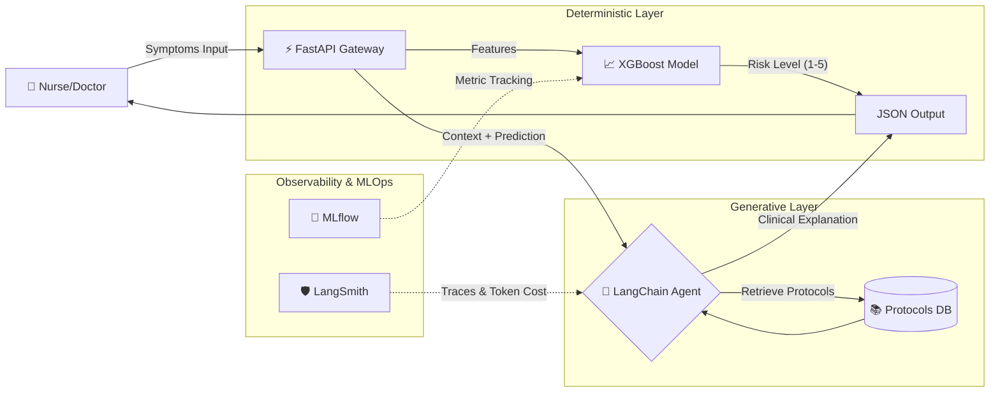

# 🏥 Intelligent Hospital Triage System (Hybrid AI)


> **Status:** 🚧 Work in Progress (MVP Phase)

A hybrid clinical decision support system that combines **Classic Machine Learning (XGBoost)** for precise risk classification (Manchester Triage Protocol) with **Generative AI (LLMs)** for explainability and clinical grounding.

---

## 📐 System Architecture

This project implements a **Hybrid AI Architecture** to solve the "Black Box" problem in medical AI.



## 🚀 Key Features
- 🎯 Deterministic Triage (XGBoost): A trained gradient boosting model that predicts the patient's risk level (Red, Orange, Yellow, Green, Blue) based on vital signs and symptoms. prioritizing Recall to minimize false negatives.
- 🧠 Clinical Explainability (GenAI): An LLM Agent (anchored via RAG) that explains why the model predicted that risk level, citing specific medical protocols to prevent hallucinations.
- ⚡ High-Performance API: Built with FastAPI and Pydantic for strict data validation.
- 🔍 MLOps Integrated: Experiment tracking with MLflow (in progress).

## 🛠️ Tech Stack
- Core: Python 3.11
- API: FastAPI, Uvicorn
- Machine Learning: XGBoost, Scikit-Learn, Pandas
- GenAI / Orchestration: LangChain, OpenAI API (or DeepSeek)
- Database: Vector Store (ChromaDB/FAISS) for medical protocols.
- Infrastructure: Docker, MLflow

## 📂 Project Structure
```Bash

hybrid-clinical-triage/
├── data/                   # Synthetic datasets for training
├── models/                 # Serialized XGBoost models (.json/.pkl)
├── src/
│   ├── api/                # FastAPI routes and controllers
│   ├── core/               # Configuration and logging
│   ├── ml/                 # Training and inference logic (XGBoost)
│   ├── llm/                # LangChain chains and prompts
│   └── schemas/            # Pydantic models for request/response
├── tests/                  # Pytest unit and integration tests
├── docker-compose.yml
└── README.md

```

## ⚡ Quick Start
### Prerequisites
1. Docker & Docker Compose
2. Python 3.11+ (if running locally)

### Running with Docker

```Bash

# Clone the repository
git clone [https://github.com/andrecodea/hybrid-clinical-triage.git](https://github.com/andrecodea/hybrid-clinical-triage.git)

# Build and Run
docker-compose up --build
The API will be available at http://localhost:8000/docs.

```

## 🗺️ Roadmap
- [x] Project Structure & Architecture Design
- [ ] Train XGBoost Baseline Model (Synthetic Data)
- [ ] Implement FastAPI Endpoints
- [ ] Integrate LangChain for Explanations
- [ ] Dockerize Application
- [ ] Add MLflow for Metric Tracking

Developed by André Codea
